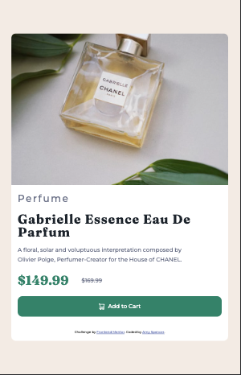

# Frontend Mentor - Product preview card component solution

This is a solution to the [Product preview card component challenge on Frontend Mentor](https://www.frontendmentor.io/challenges/product-preview-card-component-GO7UmttRfa). Frontend Mentor challenges help you improve your coding skills by building realistic projects. 

## Table of contents

- [Overview](#overview)
  - [The challenge](#the-challenge)
  - [Screenshot](#screenshot)
  - [Links](#links)
  - [Built with](#built-with)
  - [What I learned](#what-i-learned)
- [Author](#author)


## Overview

### The challenge

Users should be able to:

- View the optimal layout depending on their device's screen size
- See hover and focus states for interactive elements

### Screenshot



### Links

- Solution URL: [product-preview repo](https://github.com/amyspencerproject/product-preview-card-component)
- Live Site URL: [product-preview URL](https://amyspencerproject.github.io/product-preview-card-component/)


### Built with

- HTML5
- CSS custom properties
- Flexbox
- Mobile-first workflow


### What I learned

Things I learned during this challenge

I have been so focused on using flexbox that I have forgotten that block can also be incorporated when needed. For the desktop view I used flexbox to get the image and product description side by side in the card-wrapper div. 

```
  .card-wrapper {
      display: flex;
      justify-content: center;
      flex-flow: row nowrap;
      max-width: 35rem;
  }
```

I was struggling to get the product image to be the same height as the product description in the desktop view. Even after putting restrictions on the width and height and then increasing the padding of the product description nothing was working. I found someone else with the same issue in Frontend Mentors Slack. The solution was to set the display to block for the image div. 

HTML
```
    <section class="image-section-desktop">
      
    </section>
```
CSS
```
    .product-image {
        display: block;
        border-radius: 0.75rem 0 0 0.75rem;
    }
```
Then I used the ```<picture>``` element to make the image responsive without relying on display: hide to show/not show the different images based on screensize.

```
        <picture class="product-image">
          <source srcset="./images/image-product-desktop.jpg" media="(min-width: 600px)" />
          
        </picture>
```
Other things I learned 
- headers should be kept in sequential order. So ```<h2>``` should never go before an ```<h1>```.
- use rem or px for border-radius settings. This avoids distortions.
- for decorative images such as the shopping cart icon in the button use a blank alternative tex attribute ```alt=""```. If you leave off the alt attibute completely a screen reader will the file name of the image. Since its decorative that is annoying for the person using the screen reader.
- ```align-items:center; ``` kept changing the height of the product info element at the larger screen sizes. I didn't realize this was the culprit and kept focusing on the image.

## Author

- Website - [Amy Spencer](https://spencerproject.com/)
- Frontend Mentor - [@amyspencerproject](https://www.frontendmentor.io/profile/amyspencerproject)
- Linkedin - [amyspencercodes](https://www.linkedin.com/in/amyspencercodes/)

